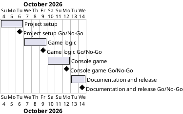

# Project Plan

## Metadata
| Key | Value |
| --- | --- |
| ID | PP-001 |
| CrossReference | [BC-001], [SA-001], [MIL-001], [MIL-002], [MIL-003], [MIL-004] |

## Version History
| Date | Status | Author | Reviewer | Change | Commit |
| --- | --- | --- | --- | --- | --- |
| 2026-10-04 | Proposed | Jens Tirsvad Nielsen | S01 | Initial version | pending |

---

## Purpose

Schedule the four phases that deliver the Higher Lower game ([BC-001] objectives O1–O5) as a small, tested, documented Python project, with S01 reviewing each phase through its own branch and pull request.

## Planning Assumptions

- Week 1 starts 2026-10-04; the plan ends by 2026-10-14 (the Business Case sets no hard date; this is the author's evening-sized target, see Open Issues).
- One phase per branch and pull request, each closing its issues.
- Nothing under `src/` or `tests/` before the milestone is accepted and the task is a row in it.
- Only S01 reviews ([SA-001]).

## Gateway Schedule

| Gateway | Document | Window | Decision date | Owner | Stories | Main deliverable | Milestone |
| --- | --- | --- | --- | --- | --- | --- | --- |
| Project setup | [MIL-001] | 2026-10-04 – 2026-10-06 | 2026-10-06 | S01 | — | pyproject, Doxyfile, skeleton, repo metadata | |
| Game logic | [MIL-002] | 2026-10-07 – 2026-10-09 | 2026-10-09 | S01 | — | Data, art, constants, pure functions, tests | |
| Console game | [MIL-003] | 2026-10-10 – 2026-10-12 | 2026-10-12 | S01 | — | Playable game loop with score, tests | |
| Documentation and release | [MIL-004] | 2026-10-13 – 2026-10-14 | 2026-10-14 | S01 | — | README, Doxygen run, review records | |



## Scope Coverage

| Business Case scope item | Gateway |
| --- | --- |
| `src/`, `tests/`, `docs/` layout, `pyproject.toml`, `.gitignore`, `Doxyfile` | [MIL-001] |
| Repository description and topics | [MIL-001] |
| Assignment data set, `logo` and `vs` art | [MIL-002] |
| Random pair selection, answer checking | [MIL-002] |
| Console game, score tracking | [MIL-003] |
| `README.md`, venv and test instructions | [MIL-004] |

## Dependencies

```
MIL-001 → MIL-002 → MIL-003 → MIL-004
```

A No-Go on any phase moves all later windows by the rework time.

## Plan Risks

| Risk | Impact | Mitigation |
| --- | --- | --- |
| README template not supplied | README task blocked | Ask S01 before MIL-004 starts |
| Host token missing or lacking scope | Cannot sync issues or set topics | Token read from `.env` for personal use only; ask S01 if absent |
| Doxygen not installed locally | Cannot verify docs build | Treat as a No-Go note; install or review comments manually |

## Open Issues

- README template: the brief says "using the template below" but none was included. Needed before MIL-004.
- Python version: "greater than 3.13" is planned as `>=3.13`; confirm if strictly 3.14+ is meant.
- Target dates are proposed, not stated in the brief; confirm.
- The brief links the organisation; the `origin` remote is the repository `014-higher_lower` within it, which is what will be synced.

---

[BC-001]: ./business-case.md
[SA-001]: ./stakeholder-analysis.md
[MIL-001]: ./milestones/mil-001-project-setup.md
[MIL-002]: ./milestones/mil-002-game-logic.md
[MIL-003]: ./milestones/mil-003-console-game.md
[MIL-004]: ./milestones/mil-004-docs-release.md
[Milestone MIL-001]: https://git.tirsystem.com/Tirsvad-Udemy-100_days_of_code/014-higher_lower/milestones/36
[Milestone MIL-002]: https://git.tirsystem.com/Tirsvad-Udemy-100_days_of_code/014-higher_lower/milestones/37
[Milestone MIL-003]: https://git.tirsystem.com/Tirsvad-Udemy-100_days_of_code/014-higher_lower/milestones/38
[Milestone MIL-004]: https://git.tirsystem.com/Tirsvad-Udemy-100_days_of_code/014-higher_lower/milestones/39
