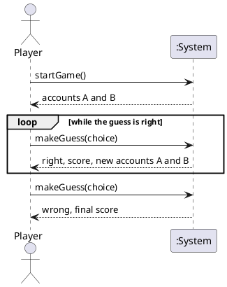

# System Sequence Diagram: Play a Game

## Metadata
| Key | Value |
| --- | --- |
| ID | SSD-001 |
| CrossReference | [UC-001] |

## Version History
| Date | Status | Author | Reviewer | Change | Commit |
| --- | --- | --- | --- | --- | --- |
| 2026-10-04 | Proposed | Jens Tirsvad Nielsen | S01 | Initial version | pending |

---

## Source Use Case

[UC-001] Play a Game, main success scenario. The alternative flows (invalid answer, tie, no account left) are out of scope for this diagram.

## Diagram

## System Operations Table

| Step | Message (verb phrase) | Parameters | Return | Use case step |
| --- | --- | --- | --- | --- |
| 1 | startGame | none | accounts A and B | 1, 2 |
| 2 | makeGuess | choice (A or B) | right, new score, new accounts A and B | 3, 4, 5, 6 |
| 3 | makeGuess | choice (A or B) | wrong, final score | 3, 7 |

Steps 2 and 3 are the same operation; the loop shows the right-guess outcome repeating, and the last call shows the wrong-guess outcome.

## Lifecycle Notes

A game starts with `startGame` and ends when `makeGuess` returns wrong; the System keeps the score and the current accounts in between.

---

[UC-001]: ./uc.md
