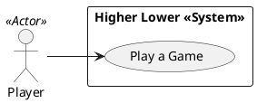

# Use Case Diagram

## Metadata
| Key | Value |
| --- | --- |
| ID | UCD-001 |
| CrossReference | [SA-001], [BC-001], [US-001], [UC-001] |

## Version History
| Date | Status | Author | Reviewer | Change | Commit |
| --- | --- | --- | --- | --- | --- |
| 2026-10-04 | Proposed | Jens Tirsvad Nielsen | S01 | Initial version | pending |

---

## Purpose and Scope

The system boundary is the Higher Lower console game. One actor, the Player, uses it to play a game. Traces to [BC-001] objective O1 and to stakeholders S01 and S02 ([SA-001]), who play the game; S03 only reads the repository.

## Diagram

## Actor Table

| Actor | Stereotype | Stakeholder ID (SA) | Goals (use cases) |
| --- | --- | --- | --- |
| Player | Actor | S01, S02 | Play a Game |

## Use Case Table

| Use Case | Actor(s) | Goal |
| --- | --- | --- |
| Play a Game ([UC-001]) | Player | Guess, round after round, which of two accounts has more followers, and see the final score |

## Relationships

None: there is a single use case, so no `<<include>>` or `<<extend>>` is used.

---

[SA-001]: ./stakeholder-analysis.md
[BC-001]: ./business-case.md
[US-001]: ./user-stories.md
[UC-001]: ./uc-001/uc.md
